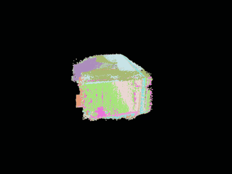
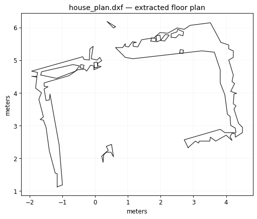

# video2cad

**Turn a single handheld home walkthrough video into a metric 3D point cloud, segmented walls/floors, and a rough CAD floor plan (DXF). Offline, Windows-friendly, built on Depth Anything 3.**

[](LICENSE)
[](https://www.python.org/)
[](#licensing)

A real run — a phone walkthrough of a home interior, reconstructed and turned into a floor plan:

| Reconstructed point cloud | Extracted floor plan |
|:---:|:---:|
|  |  |
| DA3 metric point cloud, orbiting | `house_plan.dxf`, opens in AutoCAD / FreeCAD / LibreCAD |

See [`examples/`](examples/) for the actual `house_plan.dxf` and `planes.json` from this capture.

No depth sensor, no LiDAR, no turntable, no COLMAP. One phone video in, measurable geometry out.

---

## Why this stack (state of the art, mid-2026)

| Candidate | Verdict for home video, offline, Windows |
|---|---|
| **Depth Anything 3 (DA3)** | **Chosen.** Current SOTA feed-forward geometry: ~44% better pose / ~25% better geometry accuracy than VGGT. The nested checkpoint outputs **metric depth in meters** → measurable CAD, not just up-to-scale shape. Pure PyTorch, prebuilt wheels → installs on Windows without a compiler. Code Apache-2.0. |
| VGGT (Meta) | Prior SOTA, superseded by DA3; non-commercial license. |
| MapAnything (Meta) | Strong, Apache-2.0 weights available, metric — the best fallback if you need permissive weights *and* metric scale. Slightly behind DA3 indoors. |
| MASt3R-SLAM / VGGT-SLAM | Optimized for real-time, which you don't need offline. Linux-first builds, painful on Windows. |
| COLMAP (+3DGS) | Classical gold standard with official Windows binaries — but routinely **fails on textureless interior walls** and takes hours to days. Kept as an *optional downstream*: this pipeline exports DA3 poses in COLMAP format so you can train Gaussian Splatting on top for photorealism. |

## Pipeline

```
video.mp4
  └─ frames  : sharpness-ranked keyframe extraction (blur rejection)   [CPU]
  └─ recon   : DA3 → poses + intrinsics + metric depth + confidence    [GPU]
               → confidence-filtered fusion → fused_points.ply
               → COLMAP-format export (optional 3DGS later)
  └─ cad     : gravity alignment (floor → z=0)                         [CPU]
               → iterative RANSAC planes → planes.json (wall sizes in m)
               → Poisson mesh → mesh.obj / mesh.stl
               → horizontal slice → house_plan.dxf (WALLS layer)
  └─ viz     : turntable point-cloud GIF + depth-montage GIF           [CPU]
```

**On "stitching":** there isn't an explicit one. DA3 processes all keyframes in a
single forward pass with global cross-view attention, so correspondence and
registration are learned, not post-hoc — every frame's pose comes out in one
shared world frame. Fusion is then just back-projection plus a 1 cm voxel merge.
No ICP, no pose graph, no loop closure. See [docs/PIPELINE.md](docs/PIPELINE.md).

## Install

Requires Python 3.10+ and an NVIDIA GPU (8 GB VRAM minimum, 16–24 GB comfortable).

```bash
git clone https://github.com/devanjanmishra/video2cad
cd video2cad
python -m venv .venv
source .venv/bin/activate   # Windows: .venv\Scripts\activate

# 1. torch for YOUR CUDA version (check with nvidia-smi)
#    CUDA 12.1 (driver 535+):
pip install torch torchvision --index-url https://download.pytorch.org/whl/cu121
pip install xformers --index-url https://download.pytorch.org/whl/cu121
#    CUDA 12.4 (driver 550+):
#    pip install torch torchvision --index-url https://download.pytorch.org/whl/cu124
#    pip install xformers

# 2. this pipeline (DA3 is vendored - no separate clone needed)
pip install -e .
```

> **Note:** Depth Anything 3 source is vendored inside this repo under
> `depth_anything_3/`. No separate `git clone` of DA3 is needed. Model weights
> are fetched at runtime from Hugging Face.

## Usage

### Quick start — get a recommendation

```bash
python recommend.py --video your_video.mp4
```

This prints the optimal model, resolution, batch size, and a ready-to-run command based on your GPU and video.

### Run scripts

```bash
# Single-pass (all frames in one forward pass — best quality, limited by VRAM)
python run_single.py home.mp4 out_single --rescale-height 2.1
python run_single.py home.mp4 out_single --low-res --rescale-height 2.1

# Streaming mode (recommended for long videos; upstream DA3-Streaming)
python run_streaming.py home.mp4 out_stream --chunk-size 10 --process-res 336 --no-loop --rescale-height 2.1
```

### Direct CLI

```bash
# Single-pass run (short captures only)
video2cad --video home.mp4 --workdir output \
  --model depth-anything/DA3-SMALL \
  --target-frames 16 --max-frames 16 --process-res 336 \
  --rescale-height 2.1

# Long capture (DA3-Streaming)
video2cad --video home.mp4 --workdir output --stages frames,stream,cad,viz \
  --target-frames 300 --chunk-size 10 --process-res 336 --no-loop \
  --rescale-height 2.1

# Re-tune CAD only, no GPU rerun
video2cad --workdir output --stages cad --slice-height 1.0 --rescale-height 2.1

# Generate visualization GIFs only
video2cad --workdir output --stages viz
```

Outputs in `<workdir>`: `recon/fused_points.ply`, `cad/aligned_points.ply`,
`cad/planes_colored.ply`, `cad/planes.json`, `cad/mesh.obj|.stl`, `cad/house_plan.dxf`,
`viz/turntable.gif`, and, for non-streaming runs, `viz/depth_montage.gif`.

### Streaming mode

`run_streaming.py` uses the upstream DA3-Streaming implementation for long captures.
It is **not committed to this repo** (the `Depth-Anything-3/` tree is git-ignored,
because it is large and its loop-closure component SALAD is GPL-3.0 — see
[Licensing](#licensing)). So a fresh clone must fetch it once:

```bash
# 1. fetch DA3-Streaming WITH submodules, next to this repo or anywhere
git clone --recursive https://github.com/ByteDance-Seed/Depth-Anything-3

# 2. point video2cad at its da3_streaming/ folder (or place it at ./Depth-Anything-3/da3_streaming)
export DA3_STREAMING_DIR=/abs/path/to/Depth-Anything-3/da3_streaming   # Linux/mac
#   set DA3_STREAMING_DIR=C:\path\to\Depth-Anything-3\da3_streaming    # Windows

# 3. install streaming deps + its weights
uv pip install --python .venv/bin/python -e '.[streaming]'
cd "$DA3_STREAMING_DIR" && bash scripts/download_weights.sh && cd -

# 4. run
python run_streaming.py home.mp4 out_stream --target-frames 300 --chunk-size 10 --process-res 336 --no-loop --rescale-height 2.1
```

If you keep DA3-Streaming at `./Depth-Anything-3/da3_streaming` (the default search
path), you can skip `DA3_STREAMING_DIR`; `run_streaming.py` finds it there
automatically. Pass `--streaming-dir` to override per run.

Use `--no-loop` unless the download supplied `dino_salad.ckpt`. For loop closure,
omit that flag. A 10-frame chunk at `--process-res 336` is the conservative starting
point for a 16 GB GPU. Increase either setting only when it fits, and reduce them
further if CUDA runs out of memory.

### Key flags

| Flag | Effect |
|---|---|
| `--target-frames` | more = denser and slower; 60–120 for a room, 150–250 for a flat |
| `--max-frames` | maximum keyframes allowed for the single-pass path; use streaming above this limit |
| `--process-res` | DA3 internal resolution (504/378/336); lower = less VRAM, more frames |
| `--rescale-height` | known height in meters (door=2.1, ceiling=2.7) for non-metric models |
| `--conf-percentile` | raise (e.g. 55) to drop noisy geometry, at density cost |
| `--voxel` | 0.005 for fine detail, 0.02 for lighter CAD-oriented clouds |
| `--max-depth` | clip window/mirror hallucinations (default 12 m) |
| `--slice-height` | floor-plan cut height above floor (default 1.2 m) |
| `--model` | `DA3-SMALL` (default), `DA3-LARGE-1.1`, `DA3-BASE`, or `DA3NESTED-GIANT-LARGE-1.1` |

### Single-pass VRAM limits (tested on V100 16GB, fp32)

| Model | `--process-res` | Max `--max-frames` | Quality |
|---|---|---|---|
| DA3-SMALL | 504 | 16 | Sharpest per-frame |
| DA3-SMALL | 378 | 32 | Good balance |
| **DA3-SMALL** | **336** | **40** | Highest single-pass coverage |
| DA3-LARGE | 504 | 8 | Best depth quality |
| DA3-LARGE | 336 | 20 | Large model + batch |

> **Ampere+ GPUs (RTX 30xx/40xx/A100)** use bf16, roughly doubling these limits.
> A 24 GB RTX 4090 can do ~80 frames at 504px with DA3-LARGE in one pass.

### Reconstruction paths

| | Single pass | Streaming |
|---|---|---|
| **Frames** | Limited by VRAM | Unlimited |
| **Quality** | Best when every selected frame fits at once | Upstream chunk alignment and optional loop closure for long sequences |
| **When to use** | Short videos, high VRAM | Long / whole-home captures or anything above the single-pass limit |
| **Setup** | Base dependencies | Extra weights and `.[streaming]` dependencies |

### Tested configurations (20s portrait home video, V100 16GB)

| Config | Frames | Points | Walls | Floor dims | DXF |
|---|---|---|---|---|---|
| DA3-LARGE, 504px, single 8fr | 8 | 15,839 | 0 | 0.6×1.2m | No |
| DA3-SMALL, 504px, single 16fr | 16 | 64,968 | 3 | 1.5×1.7m | No |
| DA3-SMALL, 336px, single 40fr | 40 | 36,176 | 5 | 4.8×6.0m | Yes |
| **DA3-Streaming, 336px, 10fr chunks** | **300** | **415,670** | **14** | — | **Yes** |

More frames increase coverage. Use DA3-Streaming for any capture that does not fit
in one forward pass.

## Rough-CAD workflow

- **`house_plan.dxf`** → FreeCAD (Draft workbench) or AutoCAD. Polylines are in meters on layer `WALLS`. Trace over them for a clean plan.
- **`planes.json`** → every wall/floor/ceiling with plane equation, centroid, bbox and `extent_m`. This is your fastest route to real dimensions.
- **`mesh.stl`** → FreeCAD: Mesh workbench → import → Part → *Shape from mesh* → solid for boolean/massing work. Or Blender to clean up.
- **Photorealistic twin (optional)** → point gsplat/nerfstudio at `recon/colmap/`: `ns-train splatfacto --data recon/colmap`.

## Capture tips

Accuracy lives or dies here. See [docs/CAPTURE.md](docs/CAPTURE.md) for the long version.

- Walk **slowly** (~1 m/s), one continuous take, overlap rooms through doorways.
- All lights on. Avoid filling the frame with blank wall — give the camera corners and edges.
- Two passes per room at different heights (~1.0 m and ~1.7 m) noticeably improves floors and ceilings.
- **Landscape**, not portrait (see Limitations).
- Aim for 60–120 s for a room, 4–8 min for a flat.

## Accuracy

<!-- TODO: fill this in from your own tape measure before publishing. An honest
     measured number here is worth more than any benchmark citation, and almost
     nobody in this space publishes one. -->

Values below are read from the committed [`examples/planes.json`](examples/planes.json)
(a real home-interior capture). The **ground-truth column still needs a tape measure** —
that is the one number that turns this from a demo into a validated tool, and it's
left blank deliberately rather than guessed.

| Feature | Ground truth | `planes.json` | Error |
|---|---|---|---|
| Longest wall run | _measure_ m | 6.01 m | _TBD_ |
| Room footprint (largest floor bbox) | _measure_ m | 6.24 × 5.52 m | _TBD_ |
| Floor-to-ceiling height (median of 14 walls) | _measure_ m | 2.14 m | _TBD_ |

**Internal consistency check** (needs no tape): the floor-to-ceiling height,
estimated independently from all 14 wall planes, lands at 2.09–2.30 m with a
median of 2.14 m. A typical Indian apartment ceiling is ~2.7 m and a low one
~2.4 m, so this run reads a bit low — consistent with the DA3 checkpoint used
being up-to-scale rather than the metric NESTED one. Pass `--rescale-height` with
a known height to correct it before trusting absolute dimensions.

Method: measure one wall with a tape, compare against `extent_m` of the
corresponding plane in `cad/planes.json`. List the capture and model checkpoint
with the numbers, since scale accuracy depends on both.

> Metric scale comes **only** from the nested checkpoint
> (`DA3NESTED-GIANT-LARGE-1.1`). With any other checkpoint the reconstruction is
> up-to-scale: geometry is correct in shape but the absolute meters are not, and
> you must rescale using one known measurement (e.g. a door height) before the
> DXF dimensions mean anything.

## Limitations

Honest list. Read it before trusting a number.

- **Short captures leave holes.** Geometry only exists where the camera looked. A 20 s clip gives one partial room; unseen surfaces are simply absent, and the DXF will not close into a valid loop unless you actually orbited the space.
- **Mirrors, windows and glossy TVs produce garbage depth.** The model reconstructs the *reflected/transmitted* scene as if it were real geometry — phantom rooms behind walls. Mitigate with `--max-depth`, or mask them out.
- **The DXF assumes a single storey.** The floor plan is one horizontal slice at one height. Multi-floor captures collapse into a meaningless overlay; reconstruct each floor as a separate run.
- **Portrait video is off-distribution.** These models are trained overwhelmingly on landscape imagery. Portrait input runs, but pose and depth quality degrade. Shoot landscape.
- **Textureless walls remain the hard case.** Far better than COLMAP (which fails outright), but large blank surfaces are carried by the learned prior rather than by evidence — they can come out subtly bowed or misplaced.
- **Long captures hit an O(N²) attention ceiling.** ~160 keyframes per forward pass on 24 GB. Beyond that, DA3-Streaming processes overlapping windows and aligns them with a similarity transform — any seams or scale jumps in a whole-house capture will appear at those window boundaries.
- **No semantic understanding.** Furniture, clutter and people are fused as geometry like everything else. Empty the room if you want clean walls.
- **Not validated for anything that matters.** This is a rough-CAD helper, not a survey instrument. Do not use it for structural, legal, or contractual measurements.

## Licensing

Read this before commercial use — **the code license and the weights license are different**.

- **This repository's code: Apache-2.0.** Free for commercial use, with an explicit patent grant.
- **The default checkpoint (`DA3NESTED-GIANT-LARGE-1.1`): CC BY-NC 4.0 — non-commercial only.** It is the default because it is the only one giving true metric scale. Apache-2.0 code does **not** launder a non-commercial weights license.
- **For commercial use**, pass an Apache-2.0 checkpoint: `--model depth-anything/DA3-BASE`. You lose accuracy and absolute metric scale. `MapAnything` is the alternative worth evaluating: permissive weights *and* metric.
- No weights are vendored or redistributed here; they are fetched at runtime from their original hosts under their original terms. Verify the current license on the model card yourself — they can change independently of this project.

**Vendored source code:**
- `depth_anything_3/` — DA3 core, **Apache-2.0**, committed to this repo (unmodified upstream, license retained).
- `Depth-Anything-3/da3_streaming/` — DA3-Streaming, **Apache-2.0**, **not committed** (git-ignored; fetch it yourself per [Streaming mode](#streaming-mode)).
- SALAD, the loop-closure descriptor bundled inside DA3-Streaming, is **GPL-3.0**. This is why DA3-Streaming is kept out of the committed tree: shipping GPL code inside an Apache-2.0 distribution would create a copyleft conflict. SALAD is only used by the optional loop-closure path — run streaming with `--no-loop` and it is never imported. If you choose to redistribute a tree that includes SALAD, treat that combined work as GPL-3.0.

See [NOTICE](NOTICE) for the full third-party breakdown.

## Citation

If this pipeline is useful in your work, cite the model it stands on:

```bibtex
@article{depthanything3,
  title  = {Depth Anything 3: Recovering the Visual Space from Any Views},
  author = {ByteDance Seed},
  journal= {arXiv preprint arXiv:2511.10647},
  year   = {2025}
}
```

## Acknowledgements

This project vendors [Depth Anything 3](https://github.com/ByteDance-Seed/Depth-Anything-3)
(ByteDance Seed, Apache-2.0) as its reconstruction backbone. The vendored source
is in `depth_anything_3/` and is subject to the
[DA3 license](https://github.com/ByteDance-Seed/Depth-Anything-3/blob/main/LICENSE).
Model weights are downloaded at runtime from Hugging Face under their own terms
(see [Licensing](#licensing)).

[Depth Anything 3](https://github.com/ByteDance-Seed/Depth-Anything-3) (ByteDance Seed) ·
[Open3D](https://github.com/isl-org/Open3D) · [ezdxf](https://github.com/mozman/ezdxf) · [OpenCV](https://github.com/opencv/opencv)
