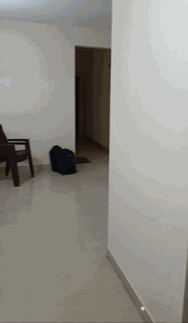

# video2cad

**One handheld phone video of a room → a metric 3D point cloud and a rough CAD floor plan (DXF). Offline, Windows-friendly, built on [Depth Anything 3](https://github.com/ByteDance-Seed/Depth-Anything-3).**

[](LICENSE)
[](https://www.python.org/)
[](https://github.com/ByteDance-Seed/Depth-Anything-3)
[](docs/LICENSING.md)

| Input: phone walkthrough | Output: reconstructed point cloud |
|:---:|:---:|
|  |  |

**One phone video in, measurable geometry out.** No depth sensor, no LiDAR, no turntable, no COLMAP.

---

## Contents

- [What it does](#what-it-does)
- [Why it's interesting](#why-its-interesting)
- [Quickstart](#quickstart)
- [How it works](#how-it-works)
- [Outputs](#outputs)
- [Limitations](#limitations)
- [Documentation](#documentation)
- [Built on Depth Anything 3](#built-on-depth-anything-3)
- [License](#license)

## What it does

Feed it a single walkthrough video of an interior. It returns:

- a **metric 3D point cloud** (`fused_points.ply`),
- **segmented walls / floors / ceilings** with real dimensions (`planes.json`),
- a **mesh** (`mesh.obj` / `mesh.stl`), and
- a 2D **floor-plan DXF** (`house_plan.dxf`) that opens in AutoCAD / FreeCAD / LibreCAD.

It runs offline (not real-time), installs on Windows without a compiler, and works
on an 8 GB GPU.

## Why it's interesting

Depth Anything 3 gives you poses and depth. It does **not** give you a CAD-ready
deliverable or a one-command workflow from a raw phone video. That gap is the
whole point of this project:

- **Video → measurable CAD, end to end.** DA3 stops at geometry; this pipeline
  carries it all the way to a dimensioned DXF floor plan and per-wall sizes.
  Nobody else in this space closes the loop to DXF.
- **Blur-aware keyframe selection** — keeps the sharpest frame per time window
  (variance-of-Laplacian), because reconstruction quality is bottlenecked by
  motion blur, not frame count.
- **Metric scale for any checkpoint** — true meters come only from the nested
  DA3 model; `--rescale-height` recovers absolute scale from one known
  measurement for the faster, permissively-licensed checkpoints.
- **CAD-oriented cleanup** — gravity alignment, RANSAC plane segmentation with
  semantic labels, Poisson meshing, and slice→contour→polyline extraction that
  straightens noisy walls into DXF.
- **Three reconstruction paths, one interface** — single-pass (best quality),
  streaming (long / whole-home, with loop closure), and a re-runnable CAD stage
  so you can re-tune output without another GPU pass.
- **Windows-first, compiler-free** — DA3 is vendored; everything installs from
  prebuilt wheels. A deliberate contrast to COLMAP-from-source or MASt3R-SLAM.
- **GPU-aware auto-tuning** — `recommend.py` inspects your GPU and video and
  prints the model, resolution, frame budget, and single-pass-vs-streaming
  choice that will actually fit, plus a ready-to-run command. No trial-and-error
  guessing at VRAM limits.

A fuller comparison against VGGT, MapAnything, MASt3R-SLAM and COLMAP is in
[docs/DESIGN.md](docs/DESIGN.md).

## Quickstart

Requires Python 3.10+ and an NVIDIA GPU (8 GB VRAM minimum, 16–24 GB comfortable).

```bash
git clone https://github.com/devanjanmishra/phone-video-3d-recon
cd phone-video-3d-recon
python -m venv .venv && source .venv/bin/activate   # Windows: .venv\Scripts\activate

# 1. install torch for YOUR CUDA version (check nvidia-smi); cu121 shown
pip install torch torchvision xformers --index-url https://download.pytorch.org/whl/cu121

# 2. install this pipeline (DA3 is vendored — no separate clone)
pip install -e .

# 3. run on the bundled sample capture
python run_single.py data/home_interiors.mp4 out --rescale-height 2.1
```

Outputs land in `out/` (`cad/house_plan.dxf`, `cad/planes.json`, `recon/fused_points.ply`, …).
Not sure which settings fit your GPU? Run `python recommend.py --video data/home_interiors.mp4`.

Full flag reference, VRAM tables, and the streaming setup are in
[docs/USAGE.md](docs/USAGE.md) and [docs/STREAMING.md](docs/STREAMING.md).

## How it works

```
video.mp4
  └─ frames  : sharpness-ranked keyframe extraction (blur rejection)   [CPU]
  └─ recon   : DA3 → poses + intrinsics + metric depth + confidence    [GPU]
               → confidence-filtered fusion → fused_points.ply
     (or)
     stream  : DA3-Streaming → chunks + Sim(3) + optional loop closure  [GPU]
  └─ cad     : gravity align → RANSAC planes → mesh → DXF floor plan    [CPU]
  └─ viz     : turntable + depth-montage GIFs                           [CPU]
```

There is **no explicit stitching step**: DA3 processes all keyframes in one
forward pass with global cross-view attention, so poses come out in a single
shared world frame and fusion is just back-projection plus a voxel merge. The
full mechanism (and the streaming path's Sim(3) chunk alignment) is in
[docs/PIPELINE.md](docs/PIPELINE.md).

## Outputs

From the bundled sample capture ([`data/home_interiors.mp4`](data/home_interiors.mp4)):

<p align="center">
  
</p>

`house_plan.dxf` — the extracted 2D floor plan, polylines in meters on layer
`WALLS`. The committed [`examples/`](examples/) folder has the real `house_plan.dxf`
and `planes.json` from this run. The heavy mesh and point-cloud files are
reproducible from the pipeline and are not committed.

## Limitations

Read this before trusting a number — the full list with mitigations is in the docs.

- **Short captures leave holes**; geometry exists only where the camera looked.
- **Mirrors, windows, glossy TVs** produce phantom geometry.
- **Single storey only** — the DXF is one horizontal slice.
- **Metric scale needs the nested checkpoint** (or `--rescale-height`).
- **Not a survey instrument** — a rough-CAD helper, not for structural, legal, or contractual measurement.

Expanded, with mitigations, in [docs/USAGE.md](docs/USAGE.md#accuracy) and
[docs/DESIGN.md](docs/DESIGN.md).

## Documentation

| Doc | What's in it |
|---|---|
| [docs/DESIGN.md](docs/DESIGN.md) | Why DA3 over the alternatives; what this project adds on top |
| [docs/USAGE.md](docs/USAGE.md) | Full flags, VRAM tables, tested configs, CAD workflow, accuracy |
| [docs/PIPELINE.md](docs/PIPELINE.md) | Stage-by-stage internals, including how frames are stitched |
| [docs/STREAMING.md](docs/STREAMING.md) | DA3-Streaming setup and loop closure |
| [docs/CAPTURE.md](docs/CAPTURE.md) | How to shoot a video that reconstructs well |
| [docs/LICENSING.md](docs/LICENSING.md) | Code vs weights vs the GPL SALAD boundary |

## Built on Depth Anything 3

This project is not a new model — it stands entirely on
**[Depth Anything 3](https://github.com/ByteDance-Seed/Depth-Anything-3)**
(ByteDance Seed), which does the hard part: recovering camera poses and dense
metric geometry from unposed images in a single feed-forward pass. The streaming
path additionally wraps ByteDance's DA3-Streaming (built on
[VGGT-Long](https://github.com/DengKaiCQ/VGGT-Long)). **Thank you** to the DA3
authors and the wider DUSt3R / VGGT lineage this work builds on.

If this pipeline is useful, please cite the model it stands on:

```bibtex
@article{depthanything3,
  title  = {Depth Anything 3: Recovering the Visual Space from Any Views},
  author = {ByteDance Seed},
  journal= {arXiv preprint arXiv:2511.10647},
  year   = {2025}
}
```

Also built with [Open3D](https://github.com/isl-org/Open3D) ·
[ezdxf](https://github.com/mozman/ezdxf) · [OpenCV](https://github.com/opencv/opencv).

## License

Code is **Apache-2.0** (see [LICENSE](LICENSE)). Model weights and the vendored
DA3-Streaming / SALAD components have their own licenses — including a **GPL-3.0**
boundary you should understand before redistributing. Full details in
[docs/LICENSING.md](docs/LICENSING.md) and [NOTICE](NOTICE).
